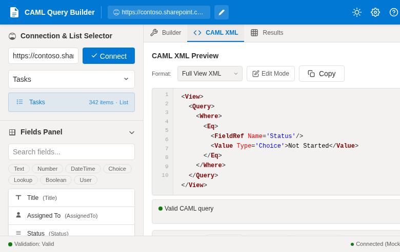

[README.md](https://github.com/user-attachments/files/25797289/README.md)
# SharePoint CAML Query Builder

**A browser-based, zero-dependency CAML query designer that runs directly inside a SharePoint page via a Content Editor WebPart.**



---

## What It Does

The SharePoint CAML Query Builder is a self-contained HTML tool that gives SharePoint developers and power users a visual, interactive interface for building, validating, and executing CAML (Collaborative Application Markup Language) queries — without leaving the browser and without installing any external software.

Key capabilities:

- **Live list & field discovery** — connects to the current SharePoint site via the REST API and JSOM to enumerate all lists and libraries, and dynamically loads the available fields/columns for the selected list.
- **Visual query construction** — lets you add filter conditions (`Where` clauses), logical operators (`And` / `Or`), `OrderBy` elements, and `ViewFields` through a point-and-click interface.
- **Real-time XML sync** — as you build conditions visually, the raw CAML XML is generated and kept in sync. You can also edit the XML directly and have it reflected back in the UI.
- **Query execution** — runs the constructed query against the selected SharePoint list using the REST API and displays the returned items inline, so you can validate results immediately.
- **Copy-ready output** — the generated CAML XML is formatted and ready to be copied into PnP PowerShell scripts, Nintex workflows, Power Automate HTTP actions, CSOM code, or any other SharePoint integration.

---

## Who It Is For

This tool is aimed at:

- **SharePoint developers** who need to prototype and validate CAML queries during list-driven development.
- **Nintex / Power Automate workflow builders** who need to test CAML filters before embedding them in workflow actions.
- **SharePoint administrators and power users** who want to inspect and filter list data without writing code.
- **DACH enterprise teams** (such as those using Pripec GmbH infrastructure) who need a GDPR-friendly, on-premise SharePoint-hosted tooling solution with no external dependencies.

The tool requires no backend, no npm packages, no build step, and no external CDNs. Everything runs inside a single HTML file within the SharePoint page context.

---

## Requirements

- SharePoint Online or SharePoint On-Premises (2016 / 2019 / Subscription Edition)
- A SharePoint site where you have at least **Read** access to lists (query execution) and **Site Member** or **Owner** permissions to add/edit pages and WebParts
- The **Content Editor WebPart (CEWP)** must be available on the target site — this is enabled by default on classic SharePoint pages

> **Note:** This tool relies on the SharePoint page context (`_spPageContextInfo`) and JSOM / REST API. It will not function correctly if opened as a standalone local HTML file outside of a SharePoint page.

---

## Deployment & Setup in a Content Editor WebPart

### Step 1 — Upload the HTML file to SharePoint

Upload `index_SharePoint_CAML.html` to a document library on your SharePoint site. A dedicated library such as **Site Assets** or a custom `Tools` library works well.

1. Navigate to your SharePoint site.
2. Open **Site Contents → Site Assets** (or your preferred library).
3. Upload `index_SharePoint_CAML.html`.
4. After upload, copy the full URL to the file (e.g. `https://yourtenant.sharepoint.com/sites/yoursite/SiteAssets/index_SharePoint_CAML.html`).

### Step 2 — Create or edit a SharePoint page

1. Navigate to the SharePoint page where you want to host the tool, or create a new **classic** wiki page / web part page.
   - Go to **Site Pages → New → Web Part Page** and choose a layout with a full-width zone.
2. Put the page in **Edit** mode.

### Step 3 — Add a Content Editor WebPart

1. In the page's web part zone, click **Add a Web Part**.
2. Under **Categories**, select **Media and Content**.
3. Select **Content Editor** and click **Add**.

### Step 4 — Link the HTML file to the CEWP

1. Click the **dropdown arrow** on the Content Editor WebPart and select **Edit Web Part**.
2. In the **Content Link** field, paste the full URL to `index_SharePoint_CAML.html` that you copied in Step 1.
3. Click **OK**.
4. Save and publish the page.

The CAML Query Builder UI will now load directly within the page, inheriting the SharePoint authentication context automatically.

### Step 5 — Verify it works

1. Open the published page.
2. The tool should render and automatically detect the current SharePoint site URL from `_spPageContextInfo`.
3. Use the **List** dropdown to select a list — available lists on the site will be populated via REST.
4. Add filter conditions, choose view fields, and click **Execute Query** to validate results.

---

## Usage Tips

- **Editing XML directly:** Switch to the XML tab to hand-edit the raw CAML. The visual builder will sync changes back when you switch tabs.
- **Copying the query:** Use the **Copy XML** button to copy the CAML for use in other tools. The output is ready for use in `<View>` blocks in Nintex, CSOM `SP.CamlQuery`, or PnP PowerShell's `-Query` parameter.
- **Row limit:** Set the row limit field to control how many items are returned during test execution (default: 100).
- **Cross-list usage:** Navigate to different SharePoint pages on the same site to target different lists — the page context is read dynamically.

---

## File Structure

```
CAML-Query-Builder/
├── index_SharePoint_CAML.html   # The complete self-contained tool (single file)
├── feature11-step9-xml-synced.png  # Screenshot — XML sync feature
└── LICENSE                      # GNU AGPL-3.0
```

---

## License

This project is licensed under the **GNU Affero General Public License v3.0 (AGPL-3.0)**.  
See the [LICENSE](LICENSE) file for full terms.

---

## Maintainer

Developed and maintained by **[Pripec GmbH](https://github.com/Pripec)**.
